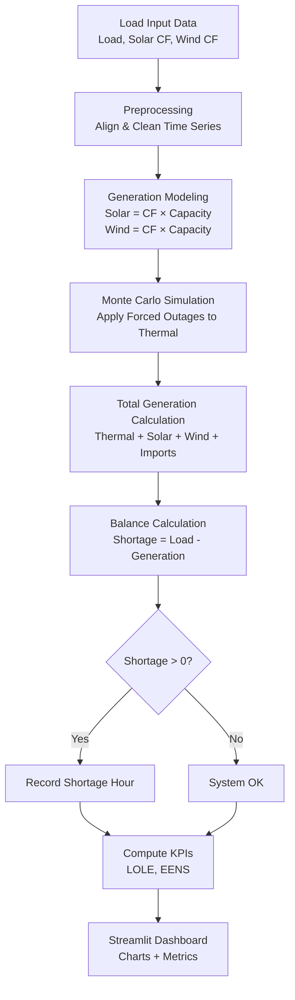

# ⚡ TSO Adequacy Analytics

A Python-based power system adequacy simulation inspired by Med-TSO / ENTSO-E planning methodologies.

This project evaluates whether a power system can meet demand under uncertainty by combining:
- Renewable variability (PECD-style profiles)
- Thermal generation
- Interconnections (imports)
- Monte Carlo outage simulation

It computes key adequacy indicators:
- **LOLE (Loss of Load Expectation)**
- **EENS (Expected Energy Not Served)**

---

##  Project Objective

This application answers a core transmission system operator (TSO) question:

> *Will the system have enough generation to meet demand at all times?*

The simulation models hourly system behavior and quantifies risk under uncertain conditions.

---

##  System Flow



---

##  How It Works

### 1. Data Input
Hourly time-series data:
- Load (demand)
- Solar capacity factor
- Wind capacity factor
- Thermal capacity
- Interconnector capacity

---

### 2. Generation Modeling
- Solar Generation = Solar CF × Installed Capacity  
- Wind Generation  = Wind CF × Installed Capacity  

---

### 3. Monte Carlo Simulation
Thermal generation is randomly reduced using a **forced outage rate**.

This simulates real-world uncertainty:
- Power plant failures
- Maintenance events
- Unexpected outages

---

### 4. System Balance
- Total Generation = Thermal + Solar + Wind + Imports  
- Shortage = Load - Total Generation  

If `shortage > 0` → system cannot meet demand.

---

### 5. Adequacy KPIs
- **LOLE (hours/year)** → Number of hours with shortage  
- **EENS (MWh/year)** → Total energy not supplied  

---

### 6. Visualization (Streamlit)
Interactive dashboard showing:
- Load vs generation
- Renewable contribution
- Shortage periods
- LOLE and EENS metrics

---

##  How to Run the App

### 1. Clone the repository
```bash
git clone https://github.com/a7madgamaltantawy/tso_adequacy_analytics.git
cd tso_adequacy_analytics
```

### 2. Create virtual environment
```bash
python3 -m venv venv
source venv/bin/activate   # Mac/Linux
```

### 3. Install dependencies
```bash
pip install -r requirements.txt
```

### 4. Run the dashboard
```bash
streamlit run dashboard/streamlit_app.py
```

Open in your browser:  
http://localhost:8501

---

##  Project Structure

```text
tso_adequacy_analytics/
│
├── data/
├── src/
│   ├── monte_carlo.py
│   ├── scenarios.py
│   ├── preprocessing.py
│   └── adequacy_metrics.py
│
├── dashboard/
│   └── streamlit_app.py
│
├── reports/
├── requirements.txt
└── README.md
```

---

##  Technologies Used
- Python  
- Pandas / NumPy  
- Streamlit  
- Monte Carlo Simulation  

---

## Key Concepts Demonstrated
- Power system adequacy analysis  
- Renewable energy integration  
- Probabilistic modeling (Monte Carlo)  
- Time-series data processing  
- Engineering + data analytics integration  

---

##  Future Improvements
- Multi-country modeling (Mediterranean grid)  
- Interconnection analysis  
- Scenario comparison (e.g., 2030 vs 2040)  
- Integration with real PECD datasets  
- Antares-style simulation extension  

---

##  Author

Ahmed Tantawy  
Energy Data Engineer